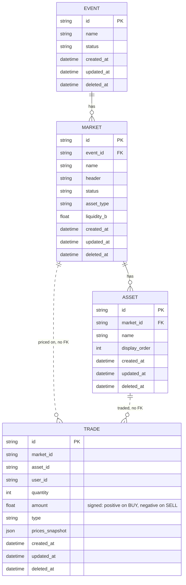
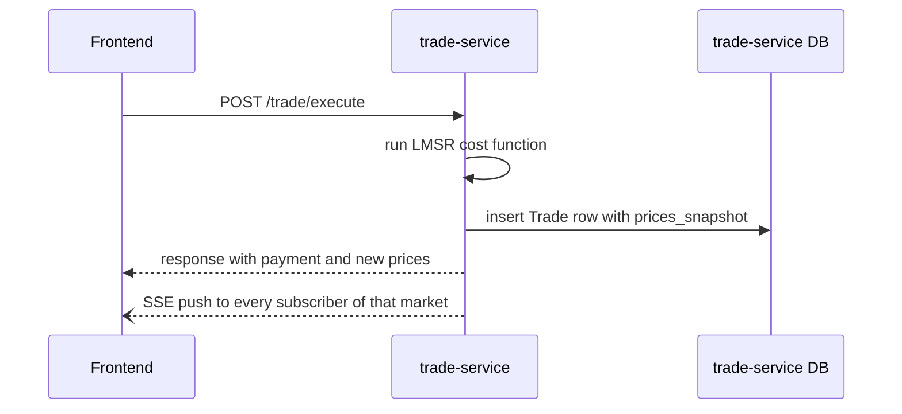
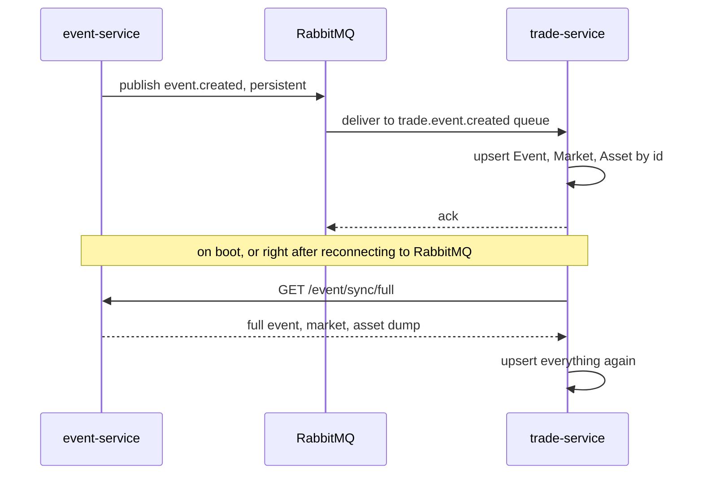

# prediction-market-trade-service

Handles everything related to actually trading, for Prediction Market: pricing
outcomes with an LMSR market maker, executing buy/sell trades, tracking user
positions, and streaming live trade/price updates to the frontend (via Server-Sent
Events) so its charts and prices update without polling.

Keeps a local, read-only synced copy ("shadow tables") of event-service's
`Event` / `Market` / `Asset` data over RabbitMQ, so it can price and validate trades
without calling event-service on every request.

Built with [Hono](https://hono.dev/) and [Prisma](https://www.prisma.io/) (Postgres).

## Design

This service owns `Trade` (who bought/sold how much of which asset, for how much) and
nothing else. It doesn't own `Event` / `Market` / `Asset`, event-service does, but it
needs that data on every request to price and validate a trade. Rather than calling
event-service synchronously each time, it keeps its own local copy, kept up to date
over RabbitMQ. See event-service's README for the sync details from that side.

Pricing uses **LMSR** (Logarithmic Market Scoring Rule), the same mechanism used by
early Polymarket and by Augur. For a market with outcomes holding quantities
`q1, q2, ..., qn`, the cost function is:

```
C(q) = b * ln( sum( exp(qi / b) ) )
```

`b` is the liquidity parameter (`Market.liquidity_b`). A trade's cost is
`C(q_after) - C(q_before)`, and the implied price of each outcome is the softmax
`exp(qi / b) / sum(exp(qj / b))`, which always sums to 1 across all outcomes.

## How the services communicate

trade-service never calls event-service on a normal request. It has a durable queue
bound to event-service's exchange, and its consumer upserts whatever it receives by
id, which makes it safe to process the same message twice. On top of that, on every
successful RabbitMQ connect (both at boot and after a reconnect), it also pulls a full
snapshot from event-service (`GET /event/sync/full`) and upserts everything again, so
it fully catches up regardless of how long it was down or what it might have missed.

Trades themselves never touch RabbitMQ. When a trade executes, this service emits an
in-process event that's pushed out over Server-Sent Events to every browser
subscribed to that market, so prices and the chart update live without the frontend
polling for changes.

## Services and tools used

- [Hono](https://hono.dev/) for the HTTP API and the SSE stream
- [Prisma](https://www.prisma.io/) with Postgres for storage
- RabbitMQ as the message broker, consumed here to stay in sync with event-service
- Hosted on [Render](https://render.com/)

## Data model

`Trade` is owned here. `Event`, `Market`, and `Asset` are a synced, read-only copy of
event-service's data (see its README for the source of truth version). `Trade`'s
links to `Market` and `Asset` aren't enforced foreign keys on purpose, a lagging sync
should never be able to block a trade from being written.



## Core flows

**Executing a trade and pushing the update live:**



`prices_snapshot` stores the resulting price of every asset right after the trade, so
the price chart and `/trade/history` can just read it back directly instead of
replaying every historical trade through the LMSR formula.

**Staying in sync with event-service, and catching up after downtime:**



This also covers a RabbitMQ outage. If the broker goes down and comes back,
trade-service reconnects, and the reconciliation pull runs again and picks up
anything it missed while disconnected.

## Known limitations

**Reconciliation does not scale past a certain data size.** `GET /event/sync/full`
returns every event, market, and asset in one unpaginated response, and this service
pulls and upserts all of it on every boot and every RabbitMQ reconnect. That is fine
for a small dataset, but once there are thousands of events with their nested markets
and assets, this call and the upsert that follows it will get slow, and most of that
work re-writes data that never changed.

Planned fix: move to an incremental sync, for example a cursor or `updated_at` based
endpoint that only returns rows changed since the last successful sync, so a reconnect
only catches up on what actually changed instead of pulling the entire dataset every
time. Not fixed yet, noting it here so it is a known tradeoff and not a silent gap.

`GET /event/sync/full` also has no auth on the event-service side, this service just
calls it in the open. That was a quick way to get reconciliation working for a
prototype, not something meant to survive contact with real traffic. See
event-service's README for the note on that.

## Endpoints

- `POST /trade/execute` - run the LMSR math and record a trade
- `GET /trade/quote` - preview a trade's price/winnings without recording it
- `GET /trade/prices` - current implied price per asset in a market
- `GET /trade/positions` - a user's current holdings in a market
- `GET /trade/history` - market-wide trade history (feeds the price chart)
- `GET /trade/user-history` - one user's own trade ledger, most recent first
- `GET /trade/stream` - SSE stream of live trades for a market

## Running

```
npm install
npm run dev
```

Runs on `http://localhost:3002` by default (configurable via `PORT`). Requires
`DATABASE_URL`, `RABBITMQ_URL`, and `EVENT_SERVICE_URL` in `.env`.
